# 📦️仓库说明

- pengpenglang第一次踏入[设计模式](https://space.bilibili.com/59546029/channel/collectiondetail?sid=266320)的随堂笔记📔
- 代码示例用java写的

# 📁设计模式分类

设计模式分为三种类型共23类，如下图


- 创建型模式：对象实例化的模式，用于解耦对象的实例化过程
- 结构性模式：把类和对象结合在一起形成一个更大的结构
- 行为型模式：类和对象如何交互及划分责任和算法

# 🚨六大设计原则

## 1️⃣单一职责原则

**定义**：不要让一个类承担过多的职责。避免职责耦合在一起，避免一个职责的变化影响到其他职

**了解**：就一个类而言应该仅有一个引起它变化的原因

## 2️⃣开放封闭原则

**定义**：需求改变时我们应该尽量通过扩展的方式加入新的代码来实现而避免修改现有代码

**理解**：开放封闭的定义——软件中的对象（类、模块、函数等）应该对于拓展是开放的，而对于修改是封闭的

比如我们要实现一个银行业务逻辑如下所示，这样直接调用BankStaff.BankHandle()方法，通过传入的参数完成对应的存取款功能。

```java
public class BankProcess {
	public void Deposite() {//存款
	}
	public void Withdraw(){//取款
	}
}
 
public class BankStaff {
	private BankProcess bankpro = new BankProcess();
	public void BankHandle(Client client) {
		switch (client.Type) {
		case "deposite": // 存款
			bankpro.Deposite();
			break;
		case "withdraw": // 取款
			bankpro.Withdraw();
			break;
		}
	}
}
```

但是这时加入了转账业务呢，就需要去修改BankProcess类，这样既违反了单一职责原则，也违反了我们的开放封闭原则，因为BankProcess职责不单一，且新需求需要修改已有的代码。因此可以使用的接口的方式进行优化：

```java
public interface IBankProcess {
	void Process();
}
 
public class DeposiProcess implements IBankProcess {
	public void Process(){ // 办理存款业务
	}
}
 
public class WithDrawProcess implements IBankProcess{
	public void Process(){ // 办理取款业务
	}
}
 
public class TransferProcess implements IBankProcess{
	public void Process(){        //办理转账业务
    }
}
 
public class BankStaff {
	private IBankProcess bankpro = null;
 
	public void BankHandle(Client client) {
		switch (client.Type) {
		case "Deposite": // 存款
			bankpro = new DeposiProcess();
			break;
		case "WithDraw": // 取款
			bankpro = new WithDrawProcess();
			break;
		case "Transfer": // 转账
			bankpro = new TransferProcess();
			break;
		}
		bankpro.Process();
	}
}
```

这样如果我们再添加功能，你会发现我们不需要修改原有的类，只需要添加一个功能类的子类即可

## 3️⃣里式替换原则

**定义**：只要父类出现的地方，子类就可以出现，替换为子类后不会产生任何错误的一场，当然反过来未必适用

**理解**：所有引用基类（父类）的地方必须能透明地使用其子类的对象，子类可以扩展父类的功能但不能改变父类原有的功能，也就是说子类继承父类时，除添加新的方法完成新增功能外，尽量不要重写父类的方法

## 4️⃣依赖导致原则

**定义**：依赖倒置原则在Java中是指接口或抽象类不依赖于实现类，而实现类依赖接口或抽象类

**理解**：如果类与类直接依赖细节，那么就会直接耦合，那么当修改时就会同时修改依赖者代码，这样限制了可扩展性。依赖倒置就是为了解决耦合，尽可能让程序依赖于抽象

下述代码很简单，但是缺点也很明显，扩展性特别差，现在只有两种车，if-else语句还算简单，假设以后有100种车…

```java
public class Fute {
	public void run() {
		System.out.println("福特汽车启动");
	}
 
	public void stop() {
		System.out.println("福特汽车停止");
	}
}
 
public class Bentian {
	public void run() {
		System.out.println("本田汽车启动");
	}
 
	public void stop() {
		System.out.println("本田汽车停止");
	}
}
 
public class AtuoRunSystem {
 
	private String mType;
	private Bentian bentian = new Bentian();
	private Fute fute = new Fute();
 
	public AtuoRunSystem(String type) {
		mType = type;
	}
 
	public void AutoRun() {
		if ("bentian".equals(mType)) {
			bentian.run();
		} else {
			fute.run();
		}
	}
 
	public void AutoStop() {
		if ("bentian".equals(mType)) {
			bentian.stop();
		} else {
			fute.stop();
		}
	}
}
```

经过改造，再加入新车我们也不怕了。这种设计也充分说明了，类与类不应该直接依赖细节，因为这样会导致耦合，限制了可扩展性，而是让类与类直接依赖抽象。

```java
public interface Icar {
	void run();
	void stop();
}
 
public class Fute implements Icar {
 
	public void run() {
		System.out.println("福特汽车启动");
 
	}
 
	public void stop() {
		System.out.println("福特汽车停止");
 
	}
 
}
 
public class Bentian implements Icar {
 
	@Override
	public void run() {
		System.out.println("本田汽车启动");
 
	}
 
	@Override
	public void stop() {
		System.out.println("本田汽车停止");
 
	}
 
}
 
public class AtuoRunSystem {
 
	private Icar icar;
 
	public AtuoRunSystem(Icar icar) {
		this.icar = icar;
	}
 
	public void autoRun() {
		icar.run();
	}
 
	public void autoStop() {
		icar.stop();
	}
 
}
```

## 5️⃣迪米特原则

**定义**：也称为最少知识原则，是指一个对象应该对其他对象有最少的了解

**理解**：一个类对自己需要耦合的类应该知道的最少，你内部多么复杂和我没关系，我只对你提供的public方法感兴趣。这样的话，如果一个系统符合迪米特法则，那么当其中某一个类发生修改时，就会尽量少地影响其他模块，降低系统的耦合度，使类与类之间保持松散的耦合关系

下面是老师让班长清点班级人数的例子：

```java
public class Teacher {
	public void commond(Monitor monitor) {
		List<Student> lists = new ArrayList();
		// 初始化同学
		for (int i = 0; i < 20; i++) {
			lists.add(new Student());
		}
		// 告诉班长清点人数
		monitor.count(lists);
	}
}
 
public class Monitor {
	// 有清查女生的工作
	public void count(List<Student> lists) {
		System.out.println(lists.size());
	}
}
 
//调用时
Teacher teacher= new Teacher();
teacher.commond(new Monitor());
```

我们看到Teacher类不仅与Monitor类产生了关系，还和Student类产生了关系。产生了不必要的耦合。这样Student类的变化不仅影响Monitor类，还会影响到Teacher类。程序优化修改后如下，调用方法不变：

```java
public class Teacher {
	public void commond(Monitor monitor) {
		monitor.count();
	}
}
 
public class Monitor {
	public void count() {
		List<Student> lists = new ArrayList();
		for (int i = 0; i < 20; i++) {
			lists.add(new Student());
		}
		System.out.println(lists.size());
	}
}
 
//调用时
Teacher teacher= new Teacher();
teacher.commond(new Monitor());
```

## 6️⃣接口隔离原则

**定义**：建立单一接口而不是建立庞大臃肿的接口，尽量细化接口，接口中的方法尽量少。也就是说，我们要为各个类建立专用的接口，而不要试图去建立一个很庞大的接口供所有依赖它的类去调用

**理解**：类间的依赖应该建立在最小的接口上

例如定义了一个接口MyInterface

```java
public interface MyInterface{
    public void method1();  
    public void method2();  
    public void method3();  
}
```

但是实现类A只想实现接口中的method1方法，而实现类B只想实现接口中的method2、method3方法。此时只写一个接口让A、B都去实现该接口的话，会导致AB中会实现不需要的方法，这样设计接口会导致接口比较臃肿，因此我们应该要把这个接口拆分开来写。很多人会觉的接口隔离原则跟之前的单一职责原则很相似，其实不然。

**单一职责原则注重的是职责，针对的是程序中的实现和细节；而接口隔离原则注重的是对接口依赖的隔离，主要针对抽象**

# 🍀设计模式关键点

1. 单例模式：某个类只能有一个实例，提供一个全局的访问点。
2. 简单工厂：一个工厂类根据传入的参量决定创建出那一种产品类的实例。
3. 工厂方法：定义一个创建对象的接口，让子类决定实例化那个类。
4. 抽象工厂：创建相关或依赖对象的家族，而无需明确指定具体类。
5. 建造者模式：封装一个复杂对象的构建过程，并可以按步骤构造。
6. 原型模式：通过复制现有的实例来创建新的实例。
7. 适配器模式：将一个类的方法接口转换成客户希望的另外一个接口。
8. 组合模式：将对象组合成树形结构以表示“”部分-整体“”的层次结构。
9. 装饰模式：动态的给对象添加新的功能。
10. 代理模式：为其他对象提供一个代理以便控制这个对象的访问。
11. 亨元模式：通过共享技术来有效的支持大量细粒度的对象。
12. 外观者模式：对外提供一个统一的方法，来访问子系统中的一群接口。
13. 桥接模式：将抽象部分和它的实现部分分离，使它们都可以独立的变化。
14. 模板模式：定义一个算法结构，而将一些步骤延迟到子类实现。
15. 解释器模式：给定一个语言，定义它的文法的一种表示，并定义一个解释器。
16. 策略模式：定义一系列算法，把他们封装起来，并且使它们可以相互替换。
17. 状态模式：允许一个对象在其对象内部状态改变时改变它的行为。
18. 观察者模式：对象间的一对多的依赖关系。
19. 备忘录模式：在不破坏封装的前提下，保持对象的内部状态。
20. 中介者模式：用一个中介对象来封装一系列的对象交互。
21. 命令模式：将命令请求封装为一个对象，使得可以用不同的请求来进行参数化。
22. 访问者模式：在不改变数据结构的前提下，增加作用于一组对象元素的新功能。
23. 责任链模式：将请求的发送者和接收者解耦，使的多个对象都有处理这个请求的机会。
24. 迭代器模式：一种遍历访问聚合对象中各个元素的方法，不暴露该对象的内部结构。

# 🧩设计模式类图

## 单例模式


## 工厂模式

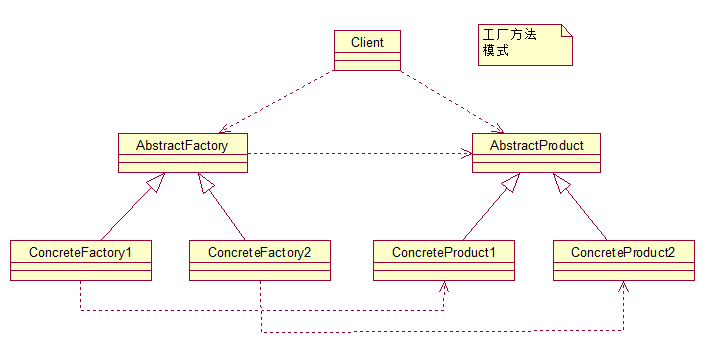

## 抽象工厂模式


## 建造者模式

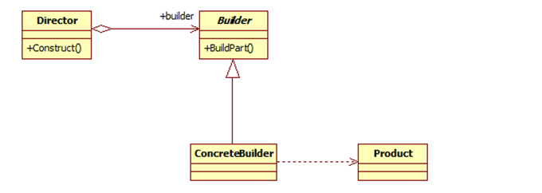

## 原型模式

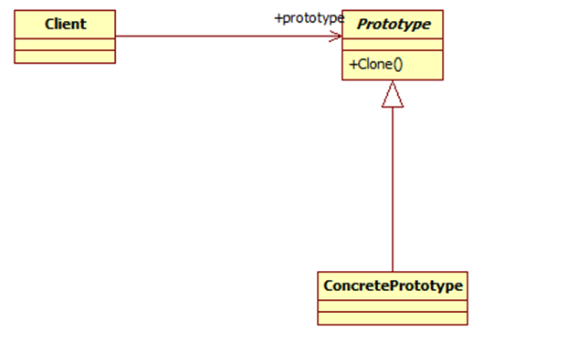

## 适配器模式


## 桥接模式

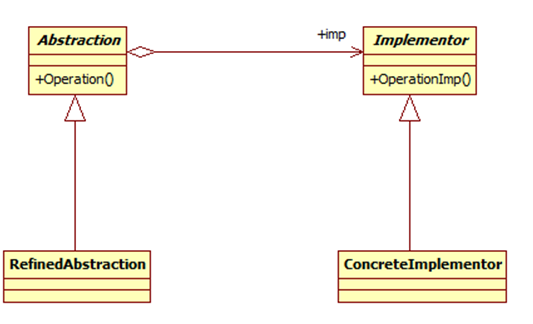

## 组合模式


## 装饰器模式


## 外观模式


## 享元模式

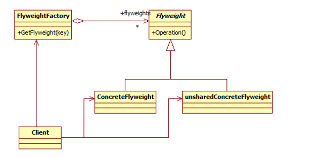

## 代理模式


## 访问者模式


## 模板模式

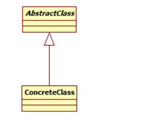

## 策略模式


## 状态模式

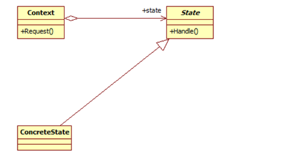

## 观察者模式

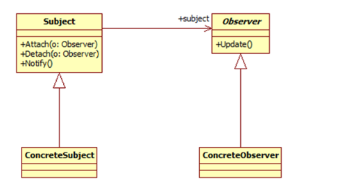

## 备忘录模式


## 中介者模式


## 迭代器模式

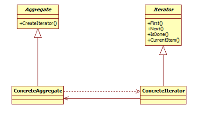

## 解释器模式

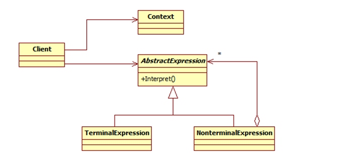

## 命令模式

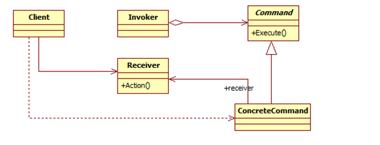

## 责任链模式

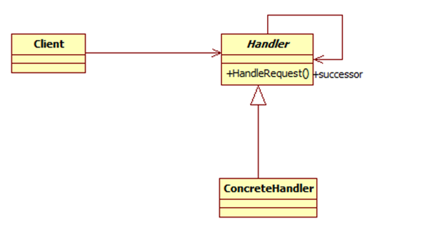

# 🔗资料参考

- [[SEU_Calvin] 设计模式三大分类以及六大原则](https://blog.csdn.net/SEU_Calvin/article/details/66994321)

- [[和代码去流浪]23种设计模式总结](https://blog.csdn.net/lgxzzz/article/details/124970034)

